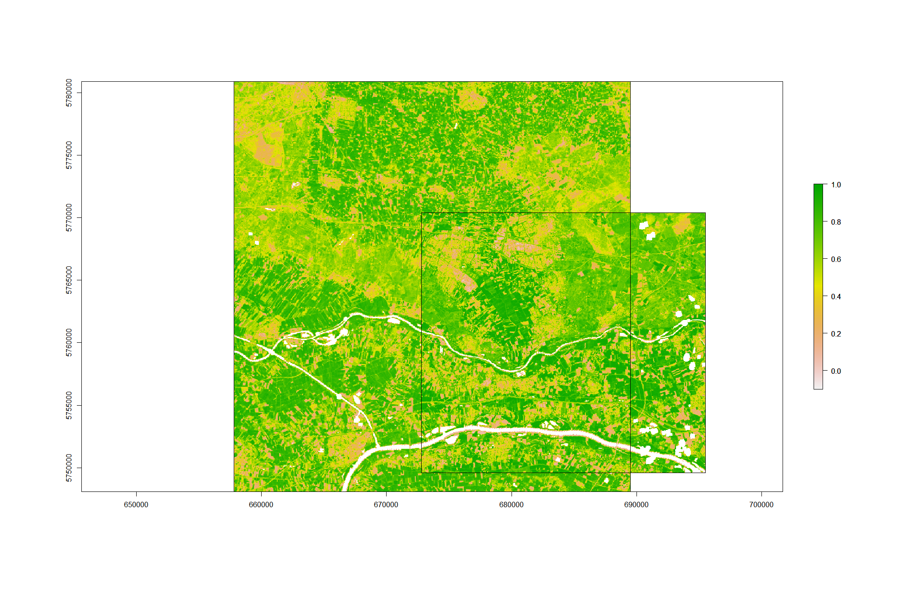
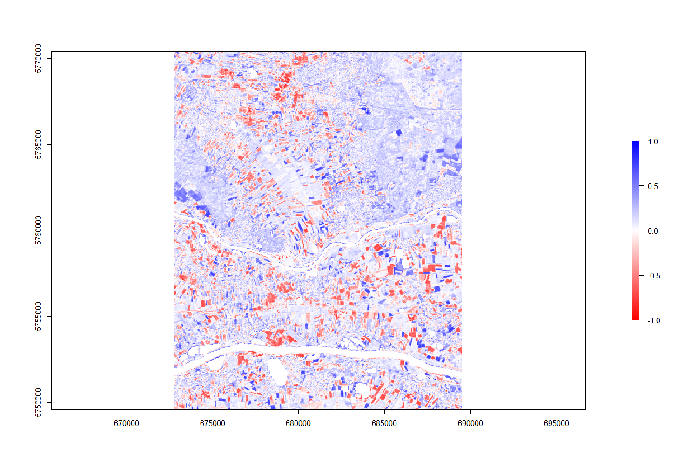
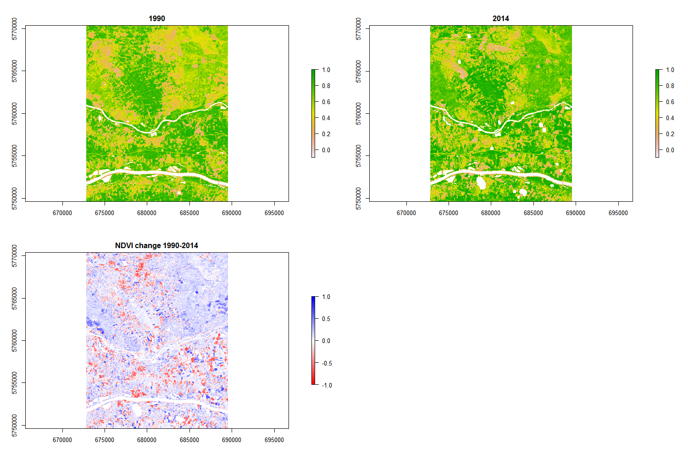

# Yesterday

* Real world example
    * Data from USGS as they come

## Step by step 

* Identify RED, NIR, and fmask layers using `list.file()`
    * `list.files(dir, pattern = glob2rx('*band3*.tif'), full.names = TRUE)`
    * `list.files(dir, pattern = glob2rx('*fmask*.tif'), full.names = TRUE)`
* (Calculate NDVI -> apply cloud mask) * 2
* Crop to intersecting extent
    * `intersect()`
* Substract the two layers

* No need to stack

---

# Visualization

---

# Visualization

---

# Visualization

Google earth

---

# My solution:

[https://github.com/GeoScripting-WUR/ExerciseLesson4](https://github.com/GeoScripting-WUR/ExerciseLesson4)