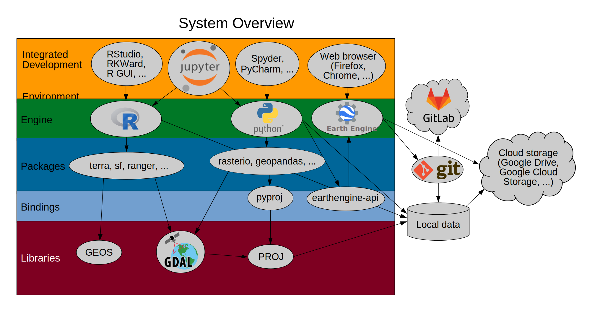

<style type="text/css">
body {max-width: none;}
a:visited {color: #91170a;}
</style>

# [WUR Geoscripting](https://geoscripting-wur.github.io/) 

# Week 1, Tutorial 4: Intro to Raster

## Learning objectives
* Read & write raster data
* Perform basic raster file operations/conversions
* Perform simple raster calculations

## Introduction
Raster data is like any image. Although it may portray various properties of objects in the real world, these objects don’t exist as separate objects; rather, they are represented using pixels of various values which are assigned a color.

Today's tutorial is about constructing a simple spatio-temporal analysis using raster data, R, and git.

## Assumed knowledge from previous tutorials

* Understand system architecture (R, R packages, libraries, drivers, bindings)
* Good scripting habits


# Reminder on overall system architecture


{width=100%}

```{block, type="alert alert-info"}
**Tip**: *RKWard* is an alternative R GUI, which is well-suited for beginners and those who are familiar with traditional statistical packages like *SPSS* and *STATISTICA*, since it is menu-driven. It is usually easier to install on Linux than *RStudio* as well. You can work in whichever R GUI you prefer.
```

In a previous tutorial you got introduced to the overall system architecture of R programming (see figure above) and briefly saw how to read and use vector data from a file into your R environment. These vector read/write operations were made possible thanks to the *GDAL* library. The figure above provides an overview of the connections between these elements. *GDAL* stands for *Geospatial Data Abstraction Library*. You can check the project home page at [http://www.gdal.org/](http://www.gdal.org/). You will be surprised to see that a lot of the software you have used in the past to read gridded geospatial data use GDAL (i.e.: ArcGIS, QGIS, GRASS, etc). In this tutorial, we will use *GDAL* indirectly via the *terra* package. However, it is also possible to call GDAL functionalities directly through the command line from a terminal, which is equivalent to calling a `system()` command directly from within R. In addition, if you are familiar with R and its string handling utilities, it may facilitate the building of the expressions that have to be passed to GDAL. (*Note*: This is also doable in *Bash* scripting, as learned in the previous tutorial, and you can even combine the two.)

Let's start working with *terra* by performing system setup checks.
```{r}
# Example to perform system set-up checks
if(!"terra" %in% rownames(installed.packages())){install.packages("terra")}
library(terra)
gdal()
```

The previous function should return the version number of the current version of *GDAL* installed on your machine. Starting with [GDAL 2.0](http://trac.osgeo.org/gdal/wiki/Release/2.0.1-News) vector processing becomes incorporated into *GDAL*. In case the function above returns an error, or if you cannot install *terra* at all, you should verify that all required software and libraries are properly installed. Please refer to the [system setup page](http://geoscripting-wur.github.io/system_setup/).

# Overview of the *terra* package
The *raster* package used to be the reference R package for raster processing, with Robert J. Hijmans as its the original developer. The introduction of the *raster* package to R was a revolution for geo-processing and analysis using R. The *raster* package is now deprecated, as Robert Hijmans has developed a successor to it called *[terra](https://cran.r-project.org/web/packages/terra/)* which is both simpler and much faster, as it's rewritten in C++.

Among other things the *terra* package allows to:

* Read and write raster data of most commonly used formats.
* Perform most raster operations, such as creation of raster objects, performing spatial/geometric operations (re-projections, resampling, etc), filtering and raster calculations.
* Work on large raster datasets thanks to its built-in block processing functionalities.
* Perform fast operations thanks to optimized back-end C++ code.
* Visualize and interact with the data.
* etc...

```{block, type="alert alert-info"}
**Tip**: Check the [home page](http://cran.r-project.org/web/packages/terra/) of the *terra* package. The package is extremely well documented, including vignettes and demos. See also the [reference manual](https://cran.r-project.org/web/packages/terra/terra.pdf) there.
```

## Explore the terra objects
The terra package produces and uses R objects of two main classes. **SpatRaster** and **SpatVector**. A SpatRaster represents a spatially referenced surface divided into three dimensional cells (rows, columns, and layers). A Spatvector represents geometries as well as attributes (variables) describing the geometries.

Let's take a look into the structure of a SpatRaster.
```{r}
# Generate a SpatRaster
r <- rast(ncol = 40, nrow = 20)
class(r)

# Simply typing the object name displays its general properties / metadata
r
```
From the metadata displayed above, we can see that the SpatRaster contains all the properties that geo-data should have; that is to say a projection, an extent and a pixel resolution.

Multi-layer SpatRasters can also fairly easily be generated directly in R, as shown in the example below.
```{r}
# Using the previously generated SpatRaster
# Let's first put some values in the cells of the layer
r[] <- rnorm(n = ncell(r))

# Create a SpatRaster with 3 layers
s <- c(r, r*2, r)

# Let's look at the properties of the resulting object
s
```

Also note that using `c()` here behaves different from using `list()`:

```{r}
# Create a list of three separate SpatRasters
s2 <- list(r, r*2, r)

# Let's look at the properties of the resulting object
s2
```


# SpatRaster manipulations
## Reading and writing from/to file
The actual data used in geo-processing projects often comes as geo-data, stored on files such as *GeoTIFF* or other commonly used file formats. Reading data directly from these files into the R working environment is made possible thanks to the *terra* package. The main command for reading raster objects from files is the `rast()` function, which returns a SpatRaster.

Writing a SpatRaster to file is achieved using the `writeRaster()` function.

To illustrate the reading and writing of raster files, we will use data subsets that we have prepared for the course and need to be downloaded from the repository. For that, first make sure your working directory is set properly. Then run the following line; it will handle the download:

```{r, eval=TRUE}
# Start by making sure that your working directory is properly set
# If not you can set it using setwd()
getwd()

# Create data directory if it does not yet exist
if (!dir.exists("data")) {
  dir.create("data")
}

# Download the data
# In case the download code doesn't work, use method = 'wget'
download.file(url = 'https://raw.githubusercontent.com/GeoScripting-WUR/IntroToRaster/gh-pages/data/gewata.zip', destfile = 'data/gewata.zip', method = 'auto')

# Unpack the archive
unzip('data/gewata.zip', exdir = "data")
```

*Gewata* is the name of the data set added. It is a multi-layer GeoTIFF object, and its file name is *LE71700552001036SGS00\_SR\_Gewata\_INT1U.tif*, informing us that this is a subset from a scene acquired by the Landsat 7 sensor. Let's not worry about the region that the data covers for now, we will find a nice way to discover that later on in the tutorial.

Now that we have downloaded and unpacked the GeoTIFF file, it should be present in our working directory. We can investigate the content of the working directory (or any directory) using the `list.files()` function.
```{r, eval=FALSE}
# When passed without arguments, list.files() returns a character vector, listing the content of the working directory
list.files()

# To get only the files with .tif extension in the data folder
list.files('data', pattern = glob2rx('*.tif'))

# Or if you are familiar with regular expressions
list.files('data', pattern = '^.*\\.tif$')
```

We can now load this object in R:
```{r}
gewata <- rast('data/LE71700552001036SGS00_SR_Gewata_INT1U.tif')
```

Let's take a look at the structure of this object.
```{r}
gewata
```
The metadata above informs us that the gewata object is a relatively small (593x653 pixels) SpatRaster with 6 layers.

## Data type is (still) important
When writing files to disk using `writeRaster()` or the `filename =` argument in most raster processing functions, you are able set an appropriate data type. Using the `datatype =` argument, you can save some precious disk space compared to the default datatype, and thus increase read and write speed.

## Geoprocessing: in memory vs. on disk
When looking at the documentation of most functions of the *terra* package, you will notice that the list of arguments is almost always ended by `...`. These 'three dots' are called an ellipsis; it means that extra arguments can be passed to the function. Often these arguments are those that can be passed to the `writeRaster()` function; meaning that most geoprocessing functions are able to write their output directly to file, on disk. This reduces the number of steps and is always a good consideration when working with big raster objects that tend to overload the memory if not written directly to file.

## Cropping a SpatRaster
`crop()` is the terra package function that allows you to crop data to smaller spatial extents. A great advantage of the crop function is that it accepts almost all spatial object classes in R as its `extent` input argument. But the `extent` argument also simply accepts objects of class `extent`. One way of obtaining such an extent object interactively is by using the `draw()` function. In the example below, we will manually draw a regular extent that we will use later to crop the *gewata* SpatRaster.

```{r, eval=FALSE}
# Plot the first layer of the SpatRaster
plot(gewata, 1)
e <- draw()
```

Now you have to define a rectangular bounding box that will define the spatial extent of the extent object. Click twice, for the two opposite corners of the rectangle. Now we can crop the data following the boundaries of this extent.

```{r, eval=FALSE}
# Crop gewata using e
gewataSub <- crop(gewata, e)

# Visualize the new cropped object
plot(gewataSub, 1)
```

You should see on the resulting plot that the original image has been cropped.

## Creating layer stacks
To end this section on general files and raster object manipulations, we will see more in-depth how multi-layer objects can be created from single-layer objects. The object created as part of the example below is the same that we will use later in the course to perform time series analysis on raster objects. It is composed of NDVI layers derived from Landsat acquisitions at different dates. The objective is therefore to create a multi-layer NDVI object, for which each layer corresponds to a different date. But first we need to fetch the data, similarly to how we did it for the *gewata* dataset.

```{r, eval=FALSE}
# Again, make sure that your working directory is properly set
getwd()

# Download and unzip the data
download.file(url = 'https://raw.githubusercontent.com/GeoScripting-WUR/IntroToRaster/gh-pages/data/tura.zip', destfile = 'data/tura.zip', method = 'auto')
unzip(zipfile = 'data/tura.zip', exdir = 'data')

# Retrieve the content of the tura sub-directory
list <- list.files(path = 'data/tura/', full.names = TRUE)
```

The object `list` contains the file names of all the single layers we have to stack. Let's open the first one to visualize it.

```{r, eval=FALSE}
plot(rast(list[1]))
```

We see an NDVI layer, with the clouds masked out. Now let's create a multi-layer SpatRaster.

```{r, eval=FALSE}
turaStack <- rast(list)
turaStack
```

Now that we have our SpatRaster with 166 layers in memory, let's write it to disk using the `writeRaster()` function. Note that we adjust the layer names to the original file names (in which information on dates is written). Also note that the data range is comprised between -10000 and +10000, therefore such a file can be stored as signed 2 byte integer (INT2S).

```{r, eval=FALSE}
# Create output directory if it does not yet exist
if (!dir.exists("output")) {
  dir.create("output")
}

# Write this file to the 
writeRaster(x = turaStack, filename = 'output/turaStack.tif', names = list.files(path = 'data/tura/'), datatype = "INT2S")
```

Now this object is stored on your computer, ready to be archived for later use.

# Simple raster arithmetic
## Adding, subtracting, multiplying and dividing SpatRasters
Performing simple raster operations with a SpatRaster is fairly easy. For instance, if you want to subtract two SpatRasters of same extent, `r1` and `r2`; simply doing `r1 - r2` will give the expected output, which is, every pixel value of `r2` will be subtracted from the matching pixel value of `r1`. These types of pixel-based operations almost always require a set of conditions to be met in order to be executed; the two SpatRasters need to be identical in term of extent, resolution, projection, etc.

## Subsetting layers from SpatRaster
Different spectral bands of a same satellite scene are often stored in multi-layer objects. This means that you will very likely import them in your R working environment as one multi-layer SpatRaster. As a consequence, to perform calculations between these bands, you will have to write an expression referring to individual layers of the object. Referring to individual layers in a SpatRaster can be done by using double square brackets `[[]]`.

Let's look for instance at how the famous NDVI index would have to be calculated from the *gewata* SpatRaster read earlier, and that contains the spectral bands of the Landsat 7 sensor. And in case you have forgotten, the NDVI formula is as follows.

$$
 NDVI=\frac{NIR-Red}{NIR+Red}
$$

with NIR and Red being band 4 and 3 of Landsat 7 respectively.

```{r}
ndvi <- (gewata[[4]] - gewata[[3]]) / (gewata[[4]] + gewata[[3]])
```

The `plot()` function automatically recognises the objects of `terra` classes and returns an appropriate spatial plot.

```{r, ndvi, fig.align='center'}
plot(ndvi)
```

The resulting NDVI can be viewed in the figure above. As expected the NDVI ranges from about 0.2, which corresponds to nearly bare soils, to 0.9, which means that there is some dense vegetation in the area.

Although this is a quick way to perform the calculation, directly adding, subtracting, multiplying, etc, the layers of big raster objects is not recommended. When working with big objects, it is advisable to use the `app()` function to perform these types of calculations. The reason is that R needs to load all the data first into its internal memory before performing the calculation and then runs everything in one block. It is really easy to run out of memory when doing that. A big advantage of the `app()` function is that it has a built-in block processing option for any vectorized function, allowing such calculations to be fully "RAM friendly". The example below illustrates how to calculate NDVI from the same date set using the `app()` function.

```{r}
# Define the function to calculate NDVI using app()
ndviApp <- function(x) {
    ndvi <- (x[[4]] - x[[3]]) / (x[[4]] + x[[3]])
    return(ndvi)
}
ndvi2 <- app(x = gewata, fun = ndviApp)
```

We can verify that the three layers ndvi, ndvi2 and ndvi3 are actually identical using the `all.equal()` function from the *terra* package.

```{r}
all.equal(ndvi, ndvi2)
```

Here we see that only the name of `ndvi2` is different. This is because for the first method, which resulted in `ndvi`, the layer name was copied from `gewata[[4]]`, whereas this was not the case for the second approach.

## Simple raster statistics
The `global()` function allows the extraction of basic global statistics from an entire SpatRaster, such as the mean value, maximum value, the range of values, or the number of NA cells. `global` will return a dataframe, from which we can consequently select the value we need. See also `?global` for more information and documentation. Let's try some of these options for our `ndvi` SpatRaster. 
```{r}
# Calculate the mean (this produces a dataframe)
mean <- global(ndvi, fun = 'mean')
mean

# Get only the value from the dataframe
mean$mean

# Calculate the amount of NA values (which should be zero in this case)
global(ndvi, fun = 'isNA')

# Calculate the amount of non-NA values
global(ndvi, fun = 'notNA')

# Which, as we have no NA values, should be equal to
ncell(ndvi)
```


## Reprojections
The `project()` function allows re-projection of raster objects to any projection one can think of. It accepts the following formats to define coordinate reference systems: *WKT*, *PROJ.4* (e.g., +proj=longlat +datum=WGS84), or an *EPSG* code (e.g., "epsg:4326"). Note that the PROJ.4 notation has been deprecated, and you can only use it with the WGS84/NAD83 and NAD27 datums. Other datums are silently ignored.

A central place to search for projections is the spatial reference website ([http://spatialreference.org/](http://spatialreference.org/)), from this database you will be able to query almost any reference and retrieve it in any format, including its *EPSG* code. Well-Known Text (*WKT*) expressions are preferred for scientific correctness and lack of ambiguity.

Instead of specifying a projection to convert to, you can also provide `project()` with another SpatRaster, and it will convert your input to the projection of that SpatRaster.

```{r}
# One single line is sufficient to project any raster to any projection
ndviLL <- project(ndvi, '+proj=longlat')
```

Note that if re-projecting and mosaicking is really a large part of your project, you may want to consider using the `gdalwarp` command line utility ([gdalwarp](http://www.gdal.org/gdalwarp.html)) directly. The `gdalUtils` R package provides utilities to run GDAL commands from R, including `gdalwarp`, for reprojection, resampling and mosaicking.


## Exporting and inspecting
By the way, we still don't know where this area is. In order to investigate that, we are going to try projecting it in QGIS. Let's write our NDVI layer in Lat/Long to a .tif file first.

```{r, eval = FALSE}
# Since this function will write a file to your working directory
# you want to make sure that it is set where you want the file to be written
# It can be changed using setwd()
getwd()

# Note that we are using the filename argument, contained in the ellipsis (...) of
# the function, since we want to write the output directly to file.
writeRaster(x = ndviLL, filename = 'output/gewataNDVI.tif')
```

Now open this file in QGIS (or ArcGIS), and add a base layer (in QGIS for instance OpenStreetMap, using XYZ tiles with the url `https://tile.openstreetmap.org/{z}/{x}/{y}.png`). Once we zoom out a bit, we see we are all the way in ... Ethiopia. More information will come later in the course about that specific area.

```{block, type="alert alert-success"}
> **Question**: Could you also have used `ndvi` SpatRaster instead of `ndviLL` for this final step? Why (not)?
```

We are done with this data set for this tutorial. So let's explore another data set, from the Landsat sensors. This dataset will allow us to find other interesting raster operations to perform.

## Performing simple value replacements
Since 2014, the USGS has started releasing Landsat data processed to surface reflectance. This means that they are taking care of important steps such as atmospheric correction and conversion from sensor radiance to reflectance factors. Additionally, they provide a cloud mask with this product. The cloud mask is an extra raster layer, at the same resolution as the surface reflectance bands, that contains information about the presence or absence of cloud as well as shadowing effects from the clouds. The cloud mask of Landsat surface reflectance product is named *cfmask*, after the name of the algorithm used to detect the clouds. For more information about cloud detection, see the [algorithm page](https://github.com/GERSL/Fmask), and the publication by [Zhu & Woodcock](https://doi.org/10.1016/j.rse.2011.10.028). In the following section we will use that cfmask layer to mask out remaining clouds in a Landsat scene.

### About the area
The area selected for this exercise covers most of the South Pacific island of Tahiti, French Polynesia. It is a mountainous, volcanic island, and according to Wikipedia about 180,000 people live on the island. For convenience, the Landsat scene was subsetted to cover only the area of interest and is stored online.

```{r, eval=TRUE}
# Download the data
download.file(url = 'https://github.com/GeoScripting-WUR/IntroToRaster/releases/download/tahiti/tahiti.zip', destfile = 'data/tahiti.zip', method = 'auto')
unzip(zipfile = 'data/tahiti.zip', exdir = 'data')

# Load the data as a SpatRaster and investigate its contents
tahiti <- rast('data/LE70530722000126_sub.tif')
tahiti

# Display names of each individual layer
names(tahiti)

# Visualize the data
plotRGB(tahiti, 3, 4, 5, stretch = "lin")
```

We can also visualize the cloud mask layer (layer 7).
```{r, fig.align='center'}
plot(tahiti, 7)
```

According to the [algorithm description](https://github.com/GERSL/Fmask), water is coded as 1, cloud as 4 and cloud shadow as 2.

Does the cloud mask fit with the visual interpretation of the RGB image we plotted before?

We can also plot the two on top of each other, but before that we need to assign no values (NA) to the 'clear land pixels' so that they appear transparent on the overlay plot.

```{r, fig.align='center'}
# Extract cloud layer from the SpatRaster
cloud <- tahiti[[7]]

# Replace 'clear land' with 'NA'
cloud[cloud == 0] <- NA

# Plot the stack and the cloud mask on top of each other
plotRGB(tahiti, 3, 4, 5, stretch = "lin")
plot(cloud, add = TRUE, legend = FALSE)
```

Applying a cloud mask to a dataset simply consists in performing value replacement. In this case, a condition on the 7th layer of the stack (the `fmask` layer) will determine whether values in the other layers are kept, or replaced by NA, which is equivalent to masking them. It is more convenient to work on the cloud mask as a separate SpatRaster. We will therefore subset the SpatRaster using the `subset()` function.

```{r}
# Extract cloud mask layer
fmask <- tahiti[[7]]

# Create a subset of the first six layers
tahiti6 <- subset(tahiti, 1:6)
```

We will first do the masking using simple vector arithmetic, as if `tahiti6` and `fmask` were simple vectors. We want to keep any value with a 'clean land pixel' flag in the cloud mask; or rather, since we are assigning NAs, we want to discard any value of the stack which has a corresponding cloud mask pixel different from 0. This can be done in one line of code.

```{r}
# Perform value replacement
tahiti6[fmask != 0] <- NA
```

However, this is possible here because both objects are relatively small and the values can all be loaded in the computer memory without any risk of overloading it. When working with very large raster objects, you will very likely run into problems if you do that. It is then preferable, as presented earlier in this tutorial to use `app()`.

```{r}
# First define a value replacement function
cloud2NA <- function(x) {
    x[1:6][x[7] != 0] <- NA
    return(x)
}
```

The value replacement function takes one argument, `x`. `x` corresponds to a SpatRaster, where the 7th layer is our cloud mask.

```{r, fig.align='center'}
# Let's create a new 6 layers object since tahiti6 has now been masked already
tahiti6_2 <- subset(tahiti, 1:6)

# Apply the function on the two SpatRasters
tahitiCloudFree <- app(x = c(tahiti6_2, fmask), fun = cloud2NA)

# Visualize the output
plotRGB(tahitiCloudFree, 3, 4, 5, stretch = "lin")
```

There are holes in the image, but at least the clouds are gone. We could use another image from another date, to create a composite image, but that is a little bit too much for today.

# Summary
Today you got a general introduction to the *terra* package, its basic functions, its object classes and methods. They can be categorized as follows:

## Terra classes

* `SpatRaster`: Single- or multi-layer object (raster).
* `SpatVector`: Geometries object (vector).

## Functions

### Reading and writing

* `rast()`: Read a raster object from disk.
* `writeRaster()`: Write a `SpatRaster` to disk.
* `filename =` argument: Available for most functions of the *terra* package that produce SpatRaster objects, write directly the output of the function to disk.

### Reformat data

* `crop()`: modify the extent of a `SpatRaster` based on another spatial object or an extent object.
* `project()`: Reproject (and resample) a `SpatRaster` to a desired coordinate reference system or reference `SpatRaster`.
* `subset()`: Create a subset of a SpatRaster.

### Simple visualization

* `plot()`: Plot a SpatRaster. Use `add = TRUE` to overlay several objects.
* `plotRGB()`: Plot an RGB color composite. Specifying the bands to assign colors as arguments.

### Raster calculations

* First of all, SpatRasters work just like vectors of numerics (`c(1, 2, 3)`). They can be subsetted, added, subtracted, etc.
* `app()`: Apply a function to every pixel independently of a single SpatRaster (Single or multi-layer). RAM friendly and can write output directly to disk using the `filename =` argument.

# Extra

* The [gdalUtilities](http://cran.r-project.org/web/packages/gdalUtilities/index.html) package provides interesting wrappers facilitating the use of GDAL functions from within R.
